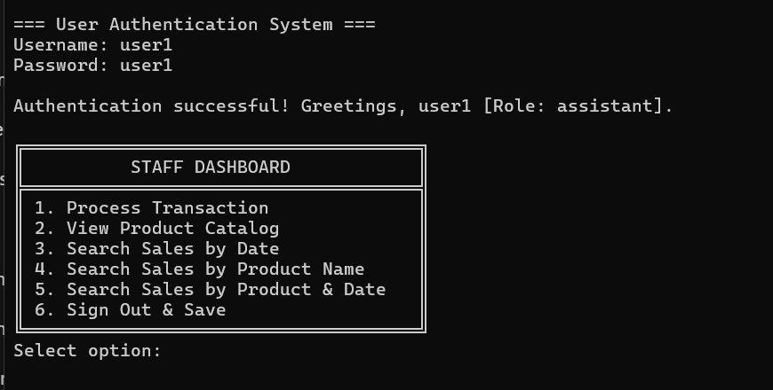
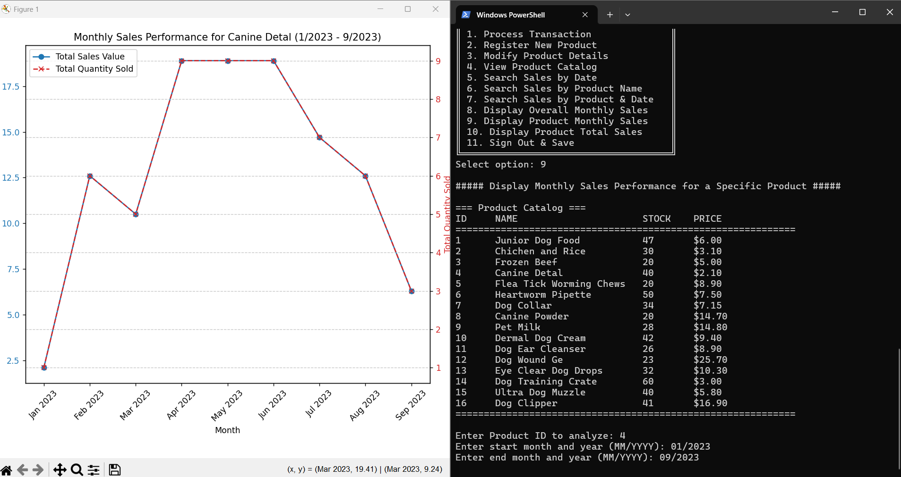
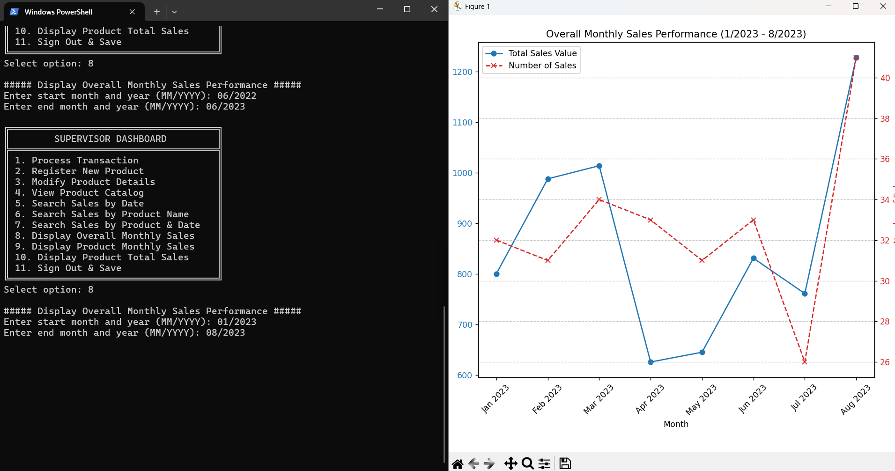
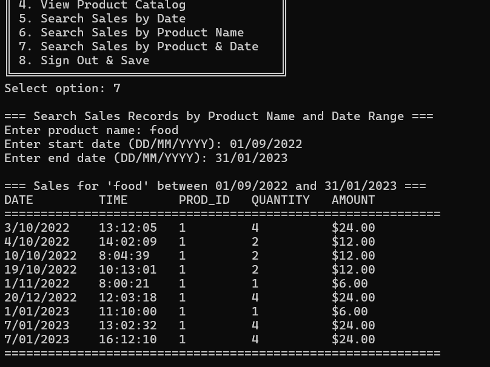
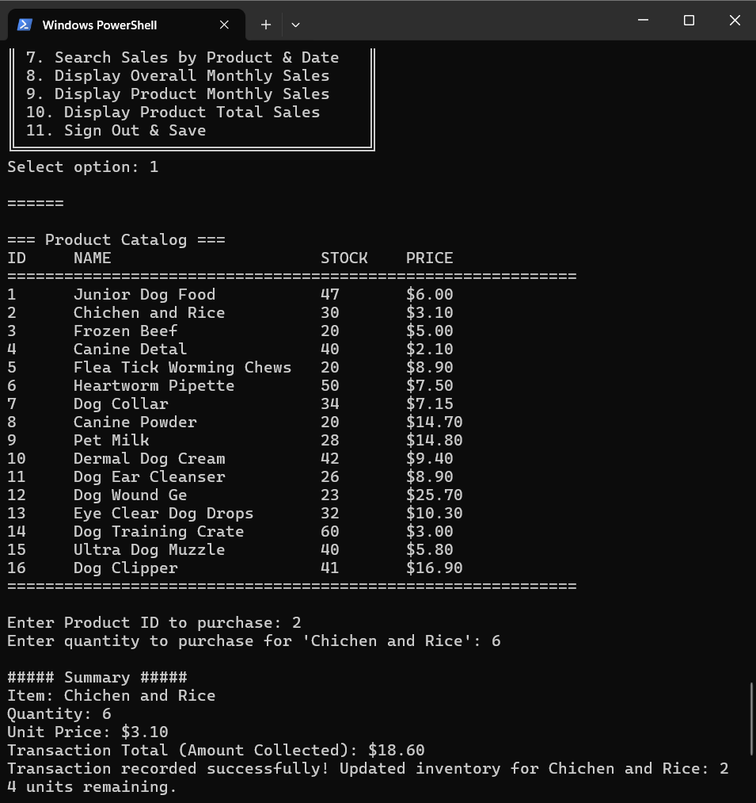

#Puppy Shop - Sales Management System


---

DBMS provides several advantages for data management and handling complex scenarios. However, in some cases, using DBMS adds unnecessary cost and complexity for small tasks.  
Specially when you have:  
- Limited users  
- Small scale of data  
- Well defined structured  
- Few functionalities  

In such cases, a designer focuses on **usability and cost-effectiveness**. Designing and handling a huge conceptual schema and maintaining a complex database is unnecessary.

In case of **File System:**  
Even though implementation is easy, it comes with limitations:  
- Data Redundancy  
- Data Inconsistency  
- Data Integrity  
- Poor Security  
- Inability to handle transactions  
- No data independence  

Despite these limitations, for this small scale project, the **File System Approach** was chosen due to its simplicity and suitability. Measures were taken to overcome some limitations.

---

## 🐶 Project Overview

**All For My Puppy** is a complete **sales management system** for a pet shop.  
Features include:  

- Managing puppy products  
- Recording sales transactions  
- User login with role-based access  
- Updating all information in CSV files  
- Advanced search for sales by date, product, or time period  
- Graphical analysis (monthly line graphs and bar charts) using `matplotlib`  

Developed in Python using **modular design principles** and approved libraries such as `csv`, `numpy`, and `matplotlib`.

**Interface:** Both **CLI** 

---

## 📂 Files

| File | Description | Metadata / Columns |
|------|-------------|------------------|
| `puppy.csv` | Stores product inventory | `product_id` (int): unique ID <br> `product_name` (string): name of the product <br> `price` (float): price per unit <br> `stock` (int): current stock level |
| `sales.csv` | Stores sales transactions | `date` (YYYY-MM-DD): date of sale <br> `time` (HH:MM:SS): time of sale <br> `product_id` (int): product sold <br> `quantity` (int): quantity sold <br> `payment` (float): amount received |
| `users.csv` | Stores user credentials | `username` (string): login username <br> `password` (string): login password <br> `role` (string): `assistant` or `manager` |
| `main_app.py` | Controller (Routes, Authenticates, Loads data) | Handles program flow, user login, menu display, file I/O, and integration between modules |
| `inventory_manager.py` | Model (Product management & inventory operations) | Functions for adding, updating, and retrieving product details; stock management |
| `transaction_processor.py` | Model (Transactions & Analytics) | Functions for recording sales, searching sales, generating analytics, and producing graphs |


---

## ⚙ Functional Requirements

- Load Required Data  
- User Login & Role-based Access  
- Display Menu  
- Enter Sales Records  
- Display Products  

**Manager Role Only:**  
- Add or Modify a Product  
- Search Sales by Date / Name / Time Period  
- Graphical Analysis (Monthly / Product-wise / Total Sales)

---

## 📝 Non-Functional Requirements

- Usability  
- Performance  
- User Interface  
- Data Integrity  
- Redundancy Control  
- Security  
- Readability and Documentation  
- Portability  

---

## 🔧 Handling File System Limitations
**Data Persistancy:**  
- `persist_system_data(transactions_file, inventory_file, transaction_records, inventory_records)` ensures:
  - Ensures all in-memory changes are persisted at logout or program exit
  - Combined with data integrity, guarantees consistent and reliable stored data 
  - Saves all sales transactions to sales.csv
  - Saves all inventory changes to puppy.csv
```bash
def persist_system_data(transactions_file, inventory_file, transaction_records, inventory_records):
    try:
        transaction_columns = ['date', 'time', 'id', 'quantity', 'payment']
        with open(transactions_file, 'w', newline='', encoding='utf-8') as file_stream:
            csv_writer = csv.DictWriter(file_stream, fieldnames=transaction_columns)
            csv_writer.writeheader()
            csv_writer.writerows(transaction_records)
        print(f"Transaction history written '{transactions_file}'.")
    except Exception as err:
        print(f"file save failed: {err}")

    try:
        inventory_columns = ['id', 'name', 'price', 'stock']
        with open(inventory_file, 'w', newline='', encoding='utf-8') as file_stream:
            csv_writer = csv.DictWriter(file_stream, fieldnames=inventory_columns)
            csv_writer.writeheader()
            csv_writer.writerows(inventory_records)
        print(f"Inventory database written to '{inventory_file}'.")
    except Exception as err:
        print(f"Inventory file save failed: {err}")
```
 
**Data Integrity:**  
- `standardize_csv_data(file_obj, required_fields)` ensures:
  - Headers are normalized  
  - Records missing required fields are rejected  
  - Values are cleared and trimmed  
  - BOM issues handled  
```bash
def standardize_csv_data(file_obj, required_fields): #before loading
    try:
        csv_reader = csv.DictReader(file_obj)
        standardized_records = []
        for entry in csv_reader:
            sanitized_entry = {}
            for header, val in entry.items():
                if header is not None:
                    processed_header = header.strip().lower().replace('\ufeff', '')
                    if processed_header in required_fields:
                        sanitized_entry[processed_header] = val.strip() if isinstance(val, str) else val
            if any(field in sanitized_entry for field in required_fields):
                standardized_records.append(sanitized_entry)
        return standardized_records

    except Exception as err:
        raise Exception(f"Data standardization failed: {err}")
```
**Redundancy Control:**  
- `register_new_item(inventory_records, generate_next_id_func)`:
  - Prevents duplicate product names  
  - Ensures product IDs are unique (Auto Generated Primary Key)  

## Transactions
`record_new_transaction(transaction_records, inventory_records, ...)` ensures:
- Each transaction records **date, time, product ID, quantity, and payment**
- Inventory stock is automatically updated after each sale
- Only valid quantities within available stock are allowed
- Timestamping guarantees unique records even for simultaneous transactions

---

## 🔄 Data Flow / Project Flow

```text
       +-------------------+
       |     users.csv     |
       +---------+---------+
                 |
          (login info)
                 v
       +-------------------+
       |   main_app.py     |
       |   (Controller)    |
       +--------+----------+
      /         |          \
     v          v           v
+---------------+  +---------------+  +------------------+
| puppy.csv     |  | sales.csv     |  | inventory_manager|
+---------------+  +---------------+  +------------------+
         |                 |                  |
         +--------+--------+------------------+
                  |
          In-memory Data Structures
                  |
                  v
          +-------------------+
          | CLI / GUI Layer    |
          +-------------------+
                  |
                  v
     +-----------------------------+
     | transaction_processor.py    |
     +-----------------------------+
                  |
                  v
       Graphs & Reports (matplotlib)

```
---

## 📈 Graphical Analysis

- Overall monthly sales (line chart for total sales value and number of transactions)  
- Product-specific monthly sales  
- Total sales per product (bar chart)  

---


## Screenshots
### CLI View

<div style="display: flex; flex-wrap: wrap; gap: 20px;">

  <div style="text-align: center;">
    
    <h4>Login</h4>
  </div>

  <div style="text-align: center;">
    
    <h4>Product View</h4>
  </div>

  <div style="text-align: center;">
    
    <h4>Month Analysis</h4>
  </div>
  <div style="text-align: center;">
    
    <h4>Search by Range</h4>
  </div>

  <div style="text-align: center;">
    
    <h4>All Product View</h4>
  </div>

</div>


## 🖥 How to Run

### CLI Version
```bash
python main_app.py sales.csv puppy.csv
```
